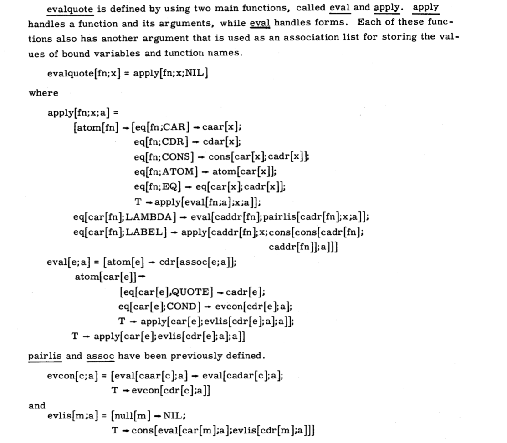

## Wizard book Study Group

Welcome! - please: sound off, video on 


---

## What is the Wizard Book?

- Structure and Interpretation of Computer Programs
- One of the recommended reading from https://teachyourselfcs.com/
- Other hacker books with funny names:
  - the dinosaur book "Operating System Concepts"
  - the dragon book "Compilers: Principles, Techniques & Tools"

---
## Why learn computer science?

There are 2 types of software engineer: those who understand computer science well enough to do challenging, innovative work, and those who just get by because they’re familiar with a few high level tools.

Both call themselves software engineers, and both tend to earn similar salaries in their early careers. But Type 1 engineers progress toward more fulfilling and well-remunerated work over time, whether that’s valuable commercial work or breakthrough open-source projects, technical leadership or high-quality individual contributions.

---
## Is it tough?

- Tried to study it alone 5 years ago, stopped at chapter 2 because
brain started to melt
- 200-300 hours of studying necessary
- Motto: if you want to learn something, teach it
- I chose to organise a study group within Coders Only

---
## Study Group

- 45 members initially
- soon whittled down to a core of 8 students
- currently 60% of the way through
- will continue until February - March 2021
- Pace: One Week = Three Weeks

---


Thanks to `Coders Only` for hosting our infrastructure

- repository on https://sourcehut.org/
- videoconferencing on https://whereby.com/

---

# Goal

> First, we want to establish the idea that a computer language is not just a  
> way of getting a computer to perform operations but rather that it is a novel
> formal medium for expressing ideas about methodology.

---

# Goal

> Thus, **programs must be written for people to read**, and only **incidentally**
> for machines to execute.

---

# Goal

> Second, we believe that the essential material to be addressed by a subject
> at this level is not
> the syntax of particular programming-language constructs, nor clever
> algorithms for computing particular
> functions efficiently, nor even the mathematical analysis of algorithms and
> the foundations of computing,

---

# Goal

> but rather **the techniques used to control the intellectual complexity
> of large software systems**.


---

# How do we meet this goal?

- `Abstraction` is the central theme
- with very simple building blocks (Lisp) we will build complex systems from scratch

---

high level of abstraction

	application programs
	high-level language (Scheme)
	low-level language (C)
	assembly language
	machine language
	architecture (registers, memory, arithmetic unit, etc.)
	circuit elements (gates)
	transistors
	solid-state physics
	quantum mechanics

low level of abstraction

---

> [Alan Kay:] Yes, that was the big revelation to me — when 
> I finally understood that the half page of code on the bottom of page 13 of the Lisp 1.5 manual 
> was Lisp in itself. 

> These were “Maxwell’s Equations of Software!” 

> This is the whole world of programming in a few lines that I can put my hand over.

---



---

## LISP isn't practical at all!

- You'll be able to use these concepts everywhere independently of the language
- If you're using Python or JavaScript, you're in luck
- The future is massive parallel computations


---

# The Book

Written very concisely

- read *everything* slowly
  - Foreword, introduction, footnotes
- don't get scared by the hairy mathematical examples, we won't use them

---

## 1  Building Abstractions with Procedures

    1.1  The Elements of Programming
    1.2  Procedures and the Processes They Generate
    1.3  Formulating Abstractions with Higher-Order Procedures

### Functional programming, recursion

---

## 2  Building Abstractions with Data

    2.1  Introduction to Data Abstraction
    2.2  Hierarchical Data and the Closure Property
    2.3  Symbolic Data
    2.4  Multiple Representations for Abstract Data
    2.5  Systems with Generic Operations

### Representing sequences and Trees

---

## 3  Modularity, Objects, and State

    3.1  Assignment and Local State
    3.2  The Environment Model of Evaluation
    3.3  Modeling with Mutable Data
    3.4  Concurrency: Time Is of the Essence
    3.5  Streams

### State and Assignments, Concurrency, Streams

---

## 4  Metalinguistic Abstraction

    4.1  The Metacircular Evaluator
    4.2  Variations on a Scheme -- Lazy Evaluation
    4.3  Variations on a Scheme -- Nondeterministic Computing
    4.4  Logic Programming

### We build a lisp interpreter in lisp

---

## 5  Computing with Register Machines

    5.1  Designing Register Machines
    5.2  A Register-Machine Simulator
    5.3  Storage Allocation and Garbage Collection
    5.4  The Explicit-Control Evaluator
    5.5  Compilation

### We build a register machine and a compiler

---
## How do we do this?

1. We are in a group

---
## How do we do this?

1. We are in a group
2. We take small bites


---
## How do we do this?

1. We are in a group
2. We take small bites
3. We follow the Berkeley lectures

---
## Berkeley course simplifies SICP

- Hairy mathematical examples avoided
- simpler constructs introduced before lists: words and sentences
- some skipping (order of chapters changed)

---
## Our repo

- All material pre-downloaded
- all code in book and lectures, translated in Racket (.rkt)
- Study schedule organized in advance
- Weekly goals organized in discord chat

---
# The language

Racket (a dialect of Scheme, which is a dialect of Lisp)


---
## Challenges

- Lisp is an old language (second oldest high-level language after FORTRAN)
- Actually a family of languages
- Tricky to find the right version/right syntax for the exercises
- sometimes really fiddly (docker containers, etc)

---
## Challenges

- We miss some modern luxuries
 - unit testing
 - helper functions such as is member of, etc - you have to do your own
 - IDE goodies such as integrated refactoring, code completion
 - Parentheses are tricky
  - overloading of meanings for parentheses

---
## The boring bits

- Some exercises are trivial or are there to explain concepts that we
master

---
## The Beauty

- Since Lisp is so simple, we are actually building stuff from scratch
- This makes you really understand how things tick
- Object-oriented programming (inheritance, message passing)
- Data structures all built with a single block, the pair
   - trees, queues, lists, sequences, streams

---
## The Beauty

- We have built a really simple lisp interpreter in lisp
- We will go on building a full lisp interpreter in lisp
- Eventually, we are going to build a register machine and a compiler. In Lisp.

---
## Eye-openers

- Trees are beautiful and *the* way to deal with two-dimensional data
```
(define (treemap fn tree)
  (cond ((null? tree) '())
    ((leaf? tree) (fn tree))
    (else (map (lambda (t) (treemap fn t)) tree)) ))
```
- recursion good, mutual recursion double plus good

---
## Eye-openers

- The main, coolest idea of OOP is message-passing, not the bloody objects
 - this is really clean decoupling

---
## Eye-openers
- Tagging/Typing
  - first thought it was super boring
  - then understood that this is what is happening deep down


---
## Mind-blowing

- Still don't really understand it: the Y combinator

```
(define Y
    (lambda (f)
      (f (lambda (x) ((Y f) x)))))
```
a way to use recursion on *anonymous* functions


  

---
## Real surprises

- Some things which seem obvious or trivial are really complex
  - Mutable state, i.e.

> x = x + 1

- Some things which seem really difficult are really simple
 - recursion
 - functional programming

---
## Quote from Teachyourselfcs.com

> SICP is unique in its ability—at least potentially—to alter your fundamental beliefs about computers and programming. 