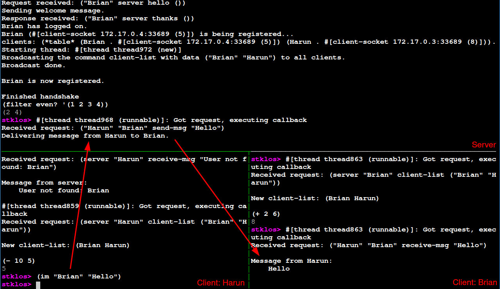

# Week 10 Instant Messaging Programs

## Server
Load im-server.scm and start the server with: `(im-server-start)`.
The server will print something like "Server IP address: 172.17.0.2, server port: 36395".
These are needed to connect to the server as a client.
Keep in mind that your server may print a different IP address and port number.
Use them to connect to the server as a client.


## Client
First set your user with setenv!, for example `(setenv! "USER" "Harun")`,
will set the environment variable "USER" to "Harun".
Now load im-client.scm and connect to the server via im-enroll `(im-enroll "172.17.0.2" 36395)`.
Sometimes loading im-client.scm after setting the USER environment variable will lead to an error,
in that case just load im-client.scm again.


## Example Session



### stklos for dummies


#### pull the latest image from docker

``` bash
$ docker pull stklos/stklos:1.60          # grab the 1.40 version of STklos
$ docker run -ti stklos/stklos:1.60       # and run it

...
stklos> (version)
"1.60"
stklos> (exit)
```

#### run a simple instance of stklos

docs: https://stklos.net/

#### run stklos within a particular directory

Navigate to the directory with the code you want to run

```
docker run -v$(pwd):/home -ti stklos/stklos:1.60 stklos
```

```
stklos> (load "im-server.scm")
stklos> (im-server)
```

