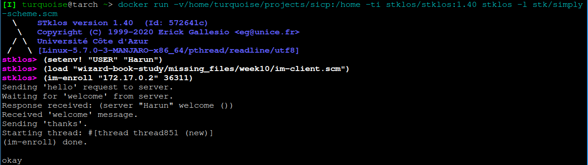

# Week 10 Instant Messaging Programs

The scheme interpreter [UCB Scheme](https://people.eecs.berkeley.edu/~bh/61a-pages/Scheme/), used in the lectures,
is a modified version of [STklos](https://www.stklos.net/).
UBC Scheme provides primitves like when-port-readable and when-socket-ready, which are not availabe in STklos.
Unfortunately UCB Scheme is no longer maintained.

Therefore the instant messaging programs, in this repository, were ported to STklos version 1.40.
They will probably also work with later versions.
The implemented primitives reside in `im-server.scm` and `im-client.scm` respectively, because it is not possible to separate them into a file.
When separated into a file, either the added functions won't be recognized or not executed at all.
It is not clear why STklos is behaving in this way.

## Introduction to STklos with Docker

### Pull the latest image from docker and start it

``` bash
$ docker pull stklos/stklos:1.60          # grab the 1.60 version of STklos
$ docker run -ti stklos/stklos:1.60       # and run it

...
stklos> (version)
"1.60"
stklos> (exit)
```

docs: https://stklos.net/

### Run STklos within a particular directory

Navigate to the directory with the code you want to run

```
cd wizard-book-study/missing_files/week10
docker run -v$(pwd):/home -ti stklos/stklos:1.60 stklos
```

```
stklos> (load "im-server.scm")
stklos> (im-server-start)
```

## Setting up the instant messaging programs
Ensure that all files reside in the same directory.
`simply-scheme.scm` is needed, load them by appending `stklos -l /path/to/simply-scheme.scm` to the STklos docker command.

### Server
Load im-server.scm, while residing in the STklos REPL and start the server with: `(im-server-start)`.
You will know that you are in a REPL, when your prompt changes to *stklos>*.
The server will print something like "Server IP address: 172.17.0.2, server port: 36395".
These are needed to connect to the server as a client.
Keep in mind that your server may print a different IP address and port number.
Use them to connect to the server as a client.


### Client
First set your user with setenv!, for example `(setenv! "USER" "Harun")`,
will set the environment variable "USER" to "Harun".
(Note that this is not the Linux shell environment variable ${USER} from outside the Docker container! It is the ${USER} variable from the Docker container where stklos is running.)
Now load im-client.scm and connect to the server via im-enroll `(im-enroll "172.17.0.2" 36395)`.
Sometimes loading im-client.scm after setting the USER environment variable will lead to an error,
in that case just repeat the aforementioned.
This means, set the environment variable "USER" with a value and load im-client.scm.


### Sending Messages
To send a message to another client the im function has to be used,
`(im "Brian" "Hello")` will send a "Hello" message to the client named Brian.

