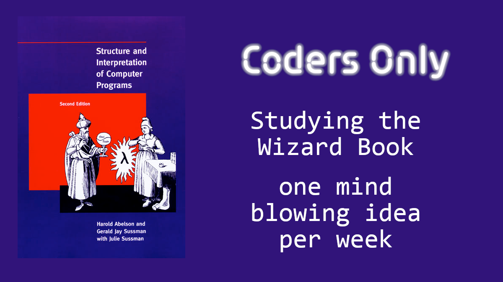
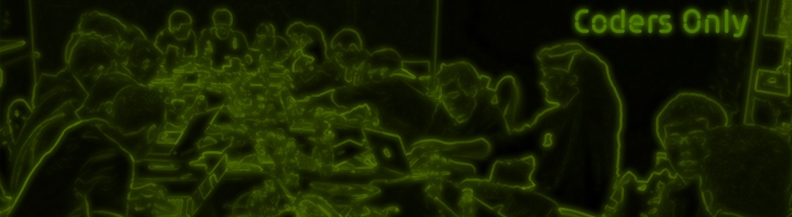

# Wizard book

## Study Group: Kick-off

---



---



Thanks to Coders Only for providing the infrastructure

- repository hub
- Teleconferencing

---

# Agenda

- Who are we (country)
- Our Goal
- the book SICP
- the Berkeley lectures
- Our Repo
- Pace
- Questions & Answers

---

# Etiquette

- stay on mute unless you talk
- raise your hand if you want to talk

Generally: no discrimination


---

# Goal

> First, we want to establish the idea that a computer language is not just a  
> way of getting a computer to perform operations but rather that it is a novel
> formal medium for expressing ideas about methodology.

---

# Goal

> Thus, **programs must be written for people to read**, and only incidentally
> for machines to execute.

---

# Goal

> Second, we believe that the essential material to be addressed by a subject
> at this level is not
> the syntax of particular programming-language constructs, nor clever
> algorithms for computing particular
> functions efficiently, nor even the mathematical analysis of algorithms and
> the foundations of computing,

---

# Goal

> but rather **the techniques used to control the intellectual complexity
> of large software systems**.


---

# The Book

Written very concisely

- read *everything* slowly
  - Foreword, introduction, footnotes
- don't get scared by the hairy mathematical examples, we won't use them

---

## 1  Building Abstractions with Procedures

    1.1  The Elements of Programming
    1.2  Procedures and the Processes They Generate
    1.3  Formulating Abstractions with Higher-Order Procedures

### Functional programming, recursion

---

## 2  Building Abstractions with Data

    2.1  Introduction to Data Abstraction
    2.2  Hierarchical Data and the Closure Property
    2.3  Symbolic Data
    2.4  Multiple Representations for Abstract Data
    2.5  Systems with Generic Operations

### Representing sequences and Trees

---

## 3  Modularity, Objects, and State

    3.1  Assignment and Local State
    3.2  The Environment Model of Evaluation
    3.3  Modeling with Mutable Data
    3.4  Concurrency: Time Is of the Essence
    3.5  Streams

### State and Assignments, Concurrency, Streams

---

## 4  Metalinguistic Abstraction

    4.1  The Metacircular Evaluator
    4.2  Variations on a Scheme -- Lazy Evaluation
    4.3  Variations on a Scheme -- Nondeterministic Computing
    4.4  Logic Programming

### We build a lisp interpreter in lisp

---

## 5  Computing with Register Machines

    5.1  Designing Register Machines
    5.2  A Register-Machine Simulator
    5.3  Storage Allocation and Garbage Collection
    5.4  The Explicit-Control Evaluator
    5.5  Compilation

### We build a register machine and a compiler

---

# The lectures

## Course Summary

---

## 1. FUNCTIONAL PROGRAMMING

- focus:
  - repeatable input-output behavior
  - composition of functions to layer complexity

- hidden:
  - side effect mechanisms (assignment)
  - internal control structure of procedures

---

## 2. DATA ABSTRACTION

- focus:
  - semantic view of data aggregates
- hidden:
  - actual representation in memory

---

## 3. OBJECT ORIENTED PROGRAMMING

- focus:
  - time-varying local state
  - metaphor of many autonomous actors

- hidden:
  - scheduling of interactions within the one computer
  - procedural methods within an object

---

## 4. STREAMS

- focus:
  - metaphor of parallel operations on data aggregates
  - signal processing model of computation

- hidden:
  - actual sequence of events in the computation

---

## 5. PROGRAMMING LANGUAGES

- focus:
  - provide a metaphor for computation
  - embody common elements of large groups of problems

- hidden:
  - technology-specific implementation medium
  - storage allocation, etc.

---

## 6. LOGIC PROGRAMMING

- focus:
  - declarative representation of knowledge
  - inference rules

- hidden:
  - inference algorithm

---

## Berkeley course deviations

- Hairy mathematical examples avoided
- simpler constructs introduced before lists: words and sentences
- some skipping (order of chapters changed)
- Chapter 5 ignored

---

## Our repo

- all code in book and lectures, translated in racket (.rkt)
- please tell me if I've missed anything


---

# The language

Racket (a dialect of Scheme, which is a dialect of Lisp)


---

## This isn't practical at all!

- You'll be able to use these concepts everywhere independently of the language
- If you're using Python or JavaScript, you're in luck
- The future is massive parallel computations

---

# Standards

- Dr Racket with

``` racket
#lang racket
(require berkeley)
```  

---

# Pace

The difficulty of the homework will determine the pace
- initial 2-3 weeks: OK?
- Wednesday or Friday?


---

# Our logistics

- Comprehension questions, homework questions: Discord
- Sessions: invites through Meetup
- Administration such as changes, admin infos: Mailing list
  - Please send me your e-mail in the chat
  - We use Delta Chat as chat client (recommended)

---

# Questions & Answers
